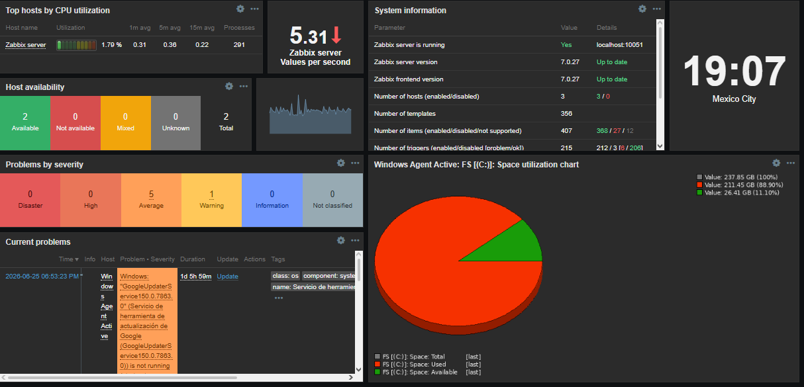
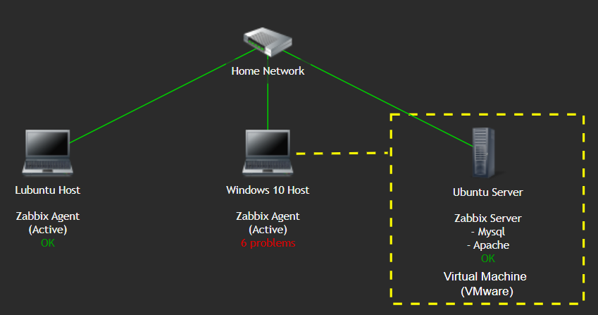
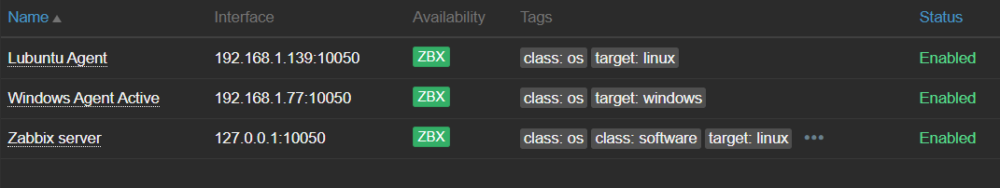

# Zabbix Monitoring Lab

A hands-on infrastructure monitoring lab built with Zabbix Server running on an Ubuntu Server virtual machine.

The lab monitors Windows and Linux endpoints using Zabbix agents and documents the deployment process, troubleshooting steps, network configuration, and monitoring features implemented throughout the project.

## Architecture

## Key Features

- Multi-platform monitoring (Windows & Linux)
- Zabbix Server deployed on Ubuntu Server
- VMware Workstation virtualization
- Active Zabbix agents
- Trigger-based monitoring
- Dashboard visualization
- User management via Zabbix UI and MySQL
- Network troubleshooting (NAT → Bridged)

## Screenshots

### Graph Example

### Monitoring Map

### Active Hosts

## Documentation

| Document | Description |
|----------|-------------|
| [Architecture](docs/architecture.md) | Infrastructure design and network layout. |
| [Installation](docs/installation.md) | Environment deployment steps. |
| [Monitoring](docs/monitoring.md) | Hosts, templates, triggers and dashboards. |
| [Troubleshooting](docs/troubleshooting.md) | Problems encountered and their solutions. |
| [Lessons Learned](docs/lessons-learned.md) | Key concepts and takeaways from the project. |

## Technologies Used

- Ubuntu Server
- VMware Workstation
- Zabbix Server 7.0 LTS
- MySQL
- Apache
- Windows 10
- Lubuntu
