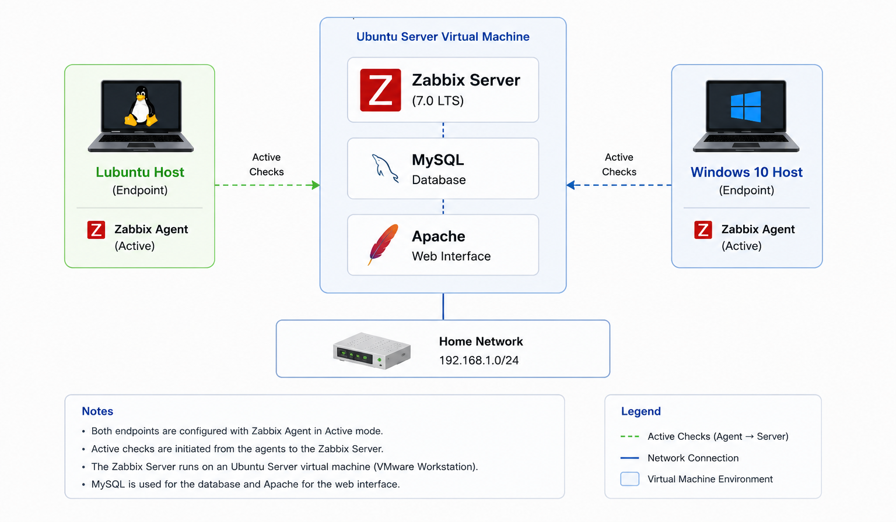
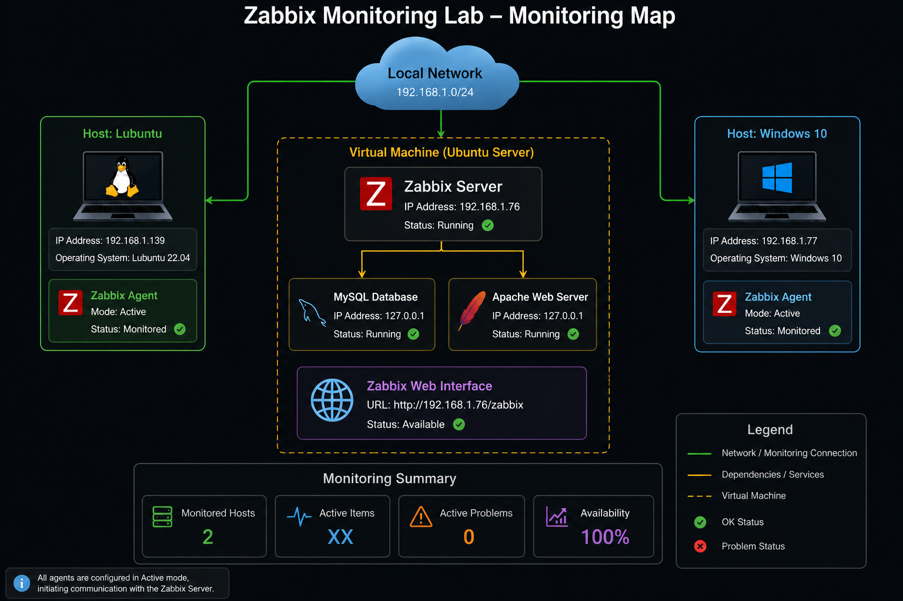

# Architecture

## Overview

This lab consists of a Zabbix Server deployed on an Ubuntu Server virtual machine and two monitored endpoints running Windows and Linux.

## Components

| Component | Purpose |
|------------|----------|
| Ubuntu Server VM | Hosts the monitoring platform |
| Zabbix Server | Collects monitoring data |
| MySQL | Stores monitoring data |
| Apache | Provides the web interface |
| Windows 10 Host | Monitored endpoint |
| Lubuntu Host | Monitored endpoint |

## Architecture Diagram

