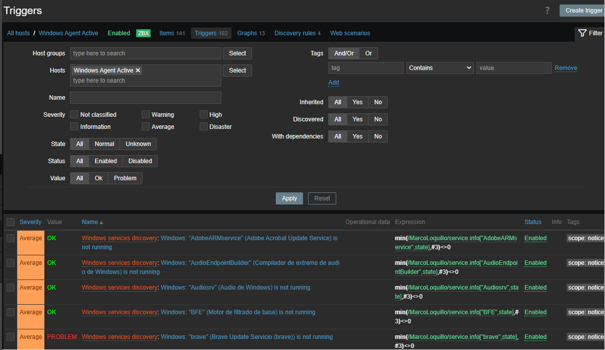
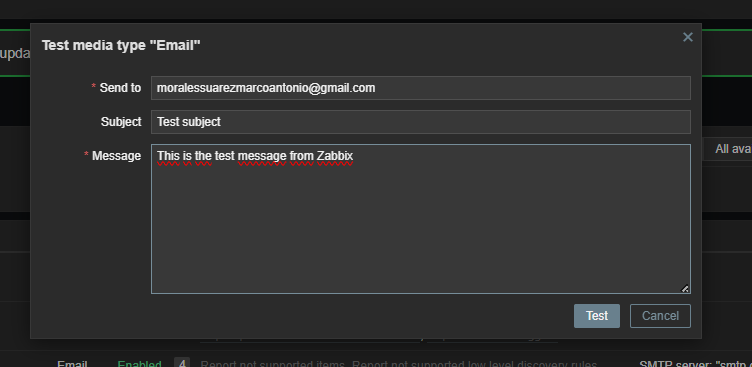
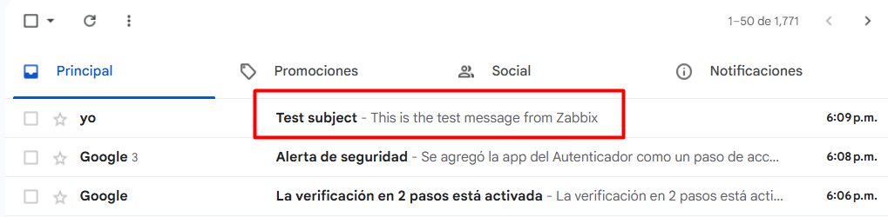

# Monitoring Configuration

## Hosts

- Windows 10 Host
- Lubuntu Host
- Zabbix Server

## Agent Mode

Both monitored endpoints use Active Checks.

## Templates

### Windows

- Windows by Zabbix agent active

### Linux

- Linux by Zabbix agent active

## Triggers

- Low disk space
- Agent unavailable
- CPU
- RAM

The monitoring environment uses the official Zabbix templates, which provide predefined triggers for common operating system events.

To verify that alerting worked correctly, trigger execution was validated by generating test events and confirming that problems were detected by the Zabbix Server.

## Dashboards

## Email Notifications

Email notifications were configured to verify that alerts could be delivered outside the monitoring platform.

A test email was sent from the Zabbix frontend to validate the notification channel.

After the test completed successfully, the notification was received in the configured mailbox.

